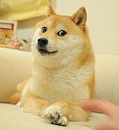
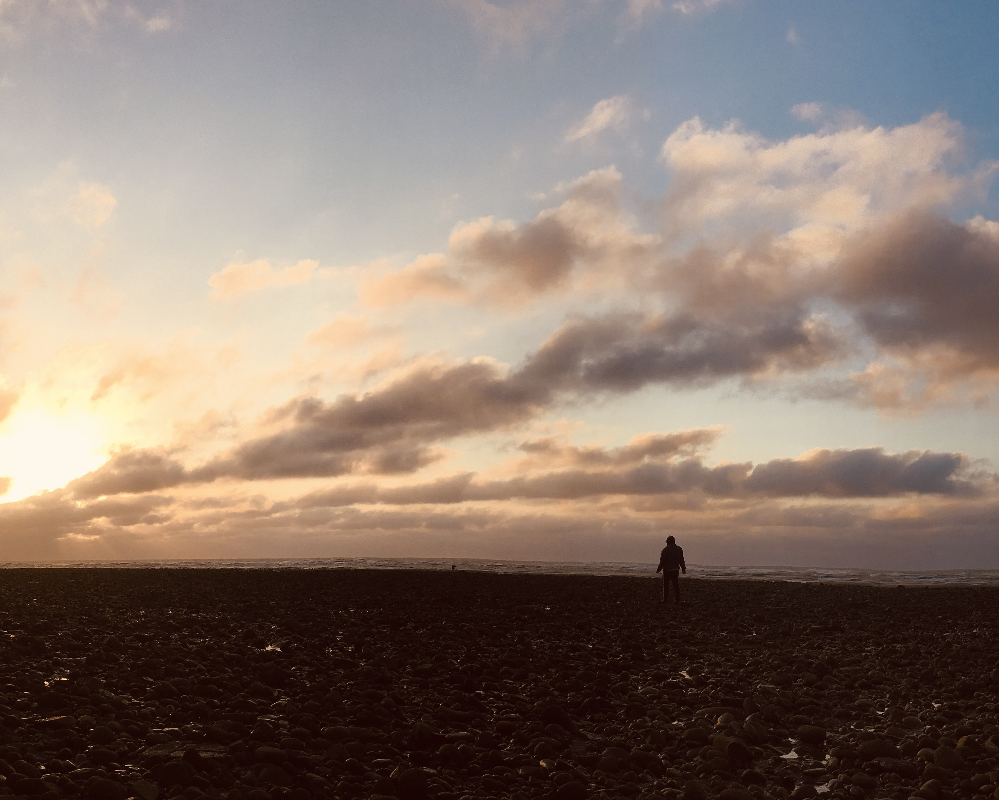
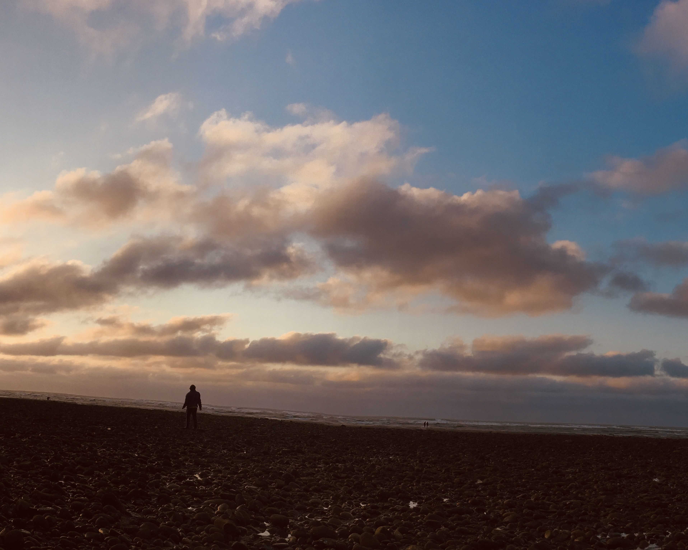
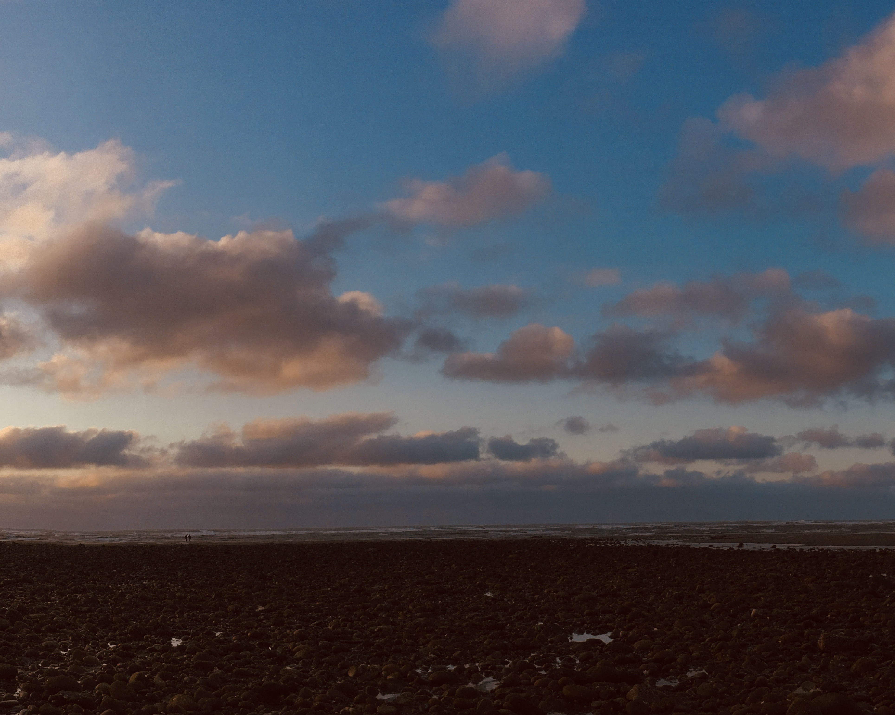

# Homography


## Quick Start

##### Requirements
- numpy
- opencv-contrib-python


##### Usage
The function of homography is implemented in [homography.py](./homography.py).
```python
# Give at least 4 pairs of corresponding points
# src_pts: Nx2 array, dst_pts: Nx2 array
H = estimate_homography(src_pts, dst_pts) # Estimate the homography matrix H (source to destination)
```

Also, there is a RANSAC version implemented in [homography.py](./homography.py).
```python
# Give at least 4 pairs of corresponding points
# match_point: Nx4 array, each row is [x1, y1, x2, y2]
H = RANSAC(match_point, iter=2000) 
```

You can use the homography to do image warping in [warping.py](./warping.py).
```python
# img1: source image, img2: destination image
# H: homography matrix (source to destination)
# direction: 'b' for backward warping, 'f' for forward warping
warped_img = warp_image(img1, img2, H, direction='b')
```


## Examples

#### Application 1: Image Placement  
- Place an image at a designated position within another image.
- Code: [application_warpNpaste.py](./application_warpNpaste.py)  
    **Input:**  
      
      
    **Output:**  
      

---

#### Application 2: Document Rectification  
- Correct perspective distortion in a photographed document.
- Code: [application_rectification.py](./application_rectification.py)  
    **Input:**  
      
    **Output:**  
      

---

#### Application 3: Augmented Reality  
- Overlay a virtual image onto a planar surface in a video. (Tracking with ArUco markers)
- Code: [application_AR.py](./application_AR.py)  
    **Input:**  
      
    **Output:**  
      

---

#### Application 4: Image Stitching  
- Combine multiple images into a panorama.
- Code: [application_panorama.py](./application_panorama.py)  
    **Input:**  
    
    
      
    **Output:**  
      