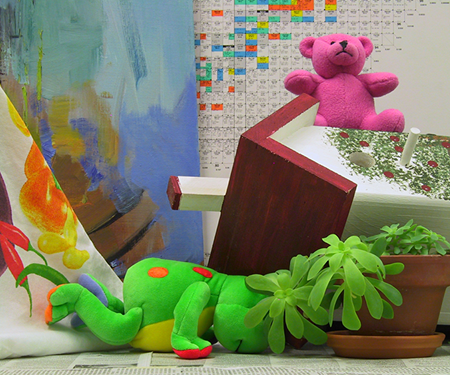
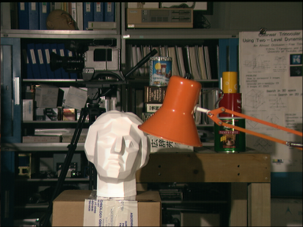
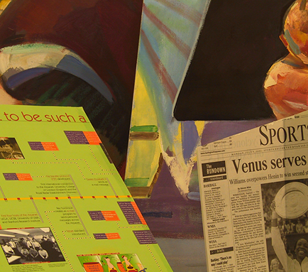

# Stereo Matching


## Quick Start

##### Requirements
- numpy
- opencv-contrib-python

##### Usage
The class of stereo matching is implemented in [computeDisp.py](./computeDisp.py).
```python
# Open the left and right images
img_left = cv2.imread(IMAGE_LEFT_PATH)
img_right = cv2.imread(IMAGE_RIGHT_PATH)

# Compute disparity
disp = computeDisp(img_left, img_right, MAX_DISPARITY)
```

##


## Introduction
- This project implements a simple [stereo matching](https://paperswithcode.com/task/stereo-matching-1) algorithm that utilizes two [rectified images](https://en.wikipedia.org/wiki/Image_rectification) to estimate the disparity (corresponding to the depth) of each pixel.

- The algorithm comprises the following steps:
    - **Preprocessing: Joint Bilateral Filtering**
      - The original image is filtered using a joint bilateral filter to reduce any noise that might be present in the image.
    - **Step 1: Cost Computation (Census Cost)**
      - We utilize a 3x3 window size for [census cost](http://www.cs.cornell.edu/~rdz/Papers/ZW-ECCV94.pdf) calculation. The census cost refers to the Hamming distance between the census transforms of the left and right images. To obtain the census transform of a pixel, we encode the relative order of pixel intensities within a window centered at that pixel as a binary string. Moreover, any pixels beyond the image boundaries are filled with the value of the nearest neighboring pixel.
    - **Step 2: Cost Aggregation (Guided Filter)**
      - After the previous step, a cost map of size *MAX_DISPARITY* $\times$ *H* $\times$ *W* &nbsp;is obtained. The guided filter is then applied using the original image as the guide, resulting in a smoother cost map.
    - **Step 3: Disparity optimization (Winner-Take-All)**
      - The disparity map is obtained by identifying the minimum cost disparity at the pixel level from the modified cost map in the previous step, resulting in a disparity map with the same dimensions as the original image.
    - **Step 4: Disparity Refinement (Left-Right Consistency Check + Weighted Median Filtering)**
      - After obtaining the disparity maps for the left and right images, a left-right consistency check is performed. Invalid pixels are marked as holes, which are then filled by selecting the minimum value from the closest valid disparity in the left and right disparity maps. Next, weighted median filtering is applied, resulting in the final output.

- Some visual results are shown below. The bad pixel rate is computed by comparing the disparity map with the ground truth. It is defined as the percentage of pixels whose disparity error is larger than 1.
    - Cones (Max Disparity: 60, Scale Factor: 4 $\rightarrow$ Bad Pixel Rate: 8.12%)
        |  |  |  |
        |:---:|:---:|:---:|
        | Left Image | Right Image | Disparity Map |
    - Teddy (Max Disparity: 60, Scale Factor: 4 $\rightarrow$ Bad Pixel Rate: 8.74%)
        |  |  |  |
        |:---:|:---:|:---:|
        | Left Image | Right Image | Disparity Map |
    - Tsukuba (Max Disparity: 15, Scale Factor: 16 $\rightarrow$ Bad Pixel Rate: 4.94%)
        |  |  |  |
        |:---:|:---:|:---:|
        | Left Image | Right Image | Disparity Map |
    - Venus (Max Disparity: 20, Scale Factor: 8 $\rightarrow$ Bad Pixel Rate: 0.37%)
        |  |  |  |
        |:---:|:---:|:---:|
        | Left Image | Right Image | Disparity Map |


##


## Example
- Data and Result

The data is sourced from the [Middlebury Stereo Datasets](https://vision.middlebury.edu/stereo/data/).
```bash
-- data
  |-- Cones
  |  |-- img_left.png
  |  |-- img_right.png
  |  |-- disp_gt.pgm
  |  
  |-- Teddy
  |  |-- img_left.png
  |  |-- img_right.png
  |  |-- disp_gt.png
  |  
  |-- Tsukuba
  |  |-- img_left.png
  |  |-- img_right.png
  |  |-- disp_gt.pgm
  |  
  |-- Venus
     |-- img_left.png
     |-- img_right.png
     |-- disp_gt.pgm


-- result
  |-- Cones_disp.png
  |-- Teddy_disp.png
  |-- Tsukuba_disp.png
  |-- Venus_disp.png
```


- Usage
```bash
python example.py --img_dir DATA_PATH \
                  --save_path OUTPUT_IMAGE_PATH (optional) \
                  --gt_path GROUND_TRUTH_PATH (optional) \
                  --max_disp MAX_DISPARITY (optional) \
                  --scale_factor SCALE_FACTOR (optional)

E.g., python example.py --img_dir ./data/Cones \
                        --save_path ./result/Cones_disp.png \
                        --gt_path ./data/Cones/disp_gt.pgm \
                        --max_disp 60 \
                        --scale_factor 4
```
